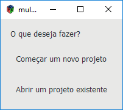
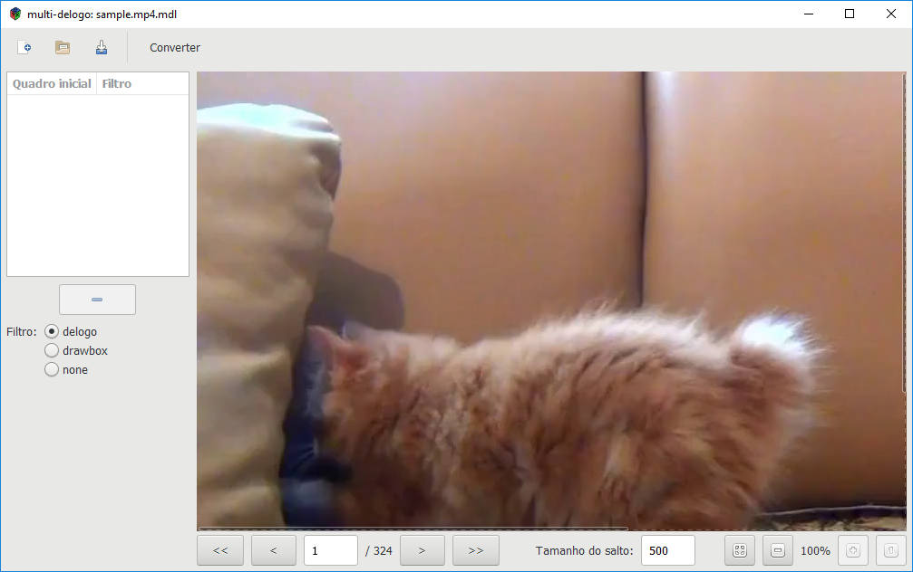
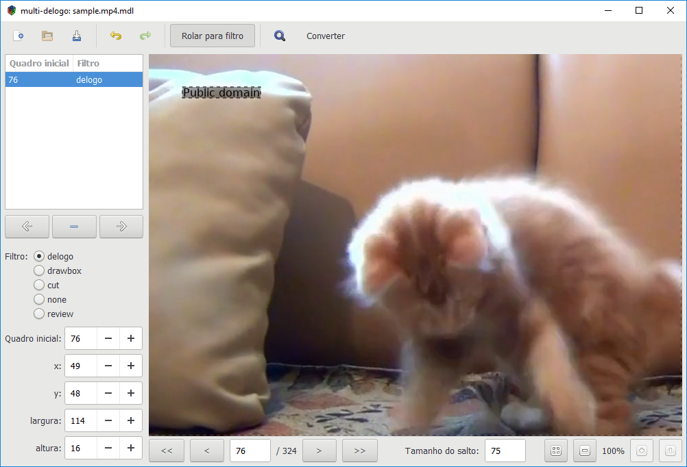
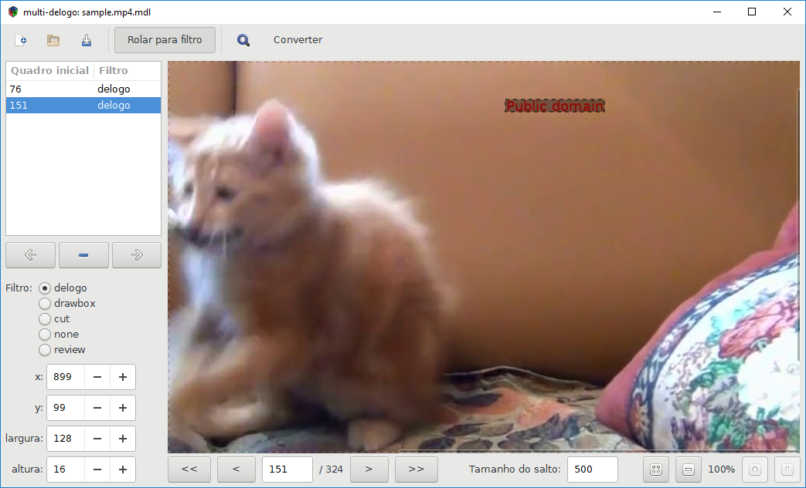
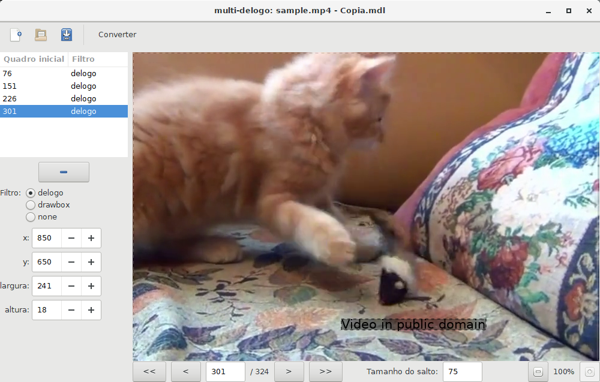
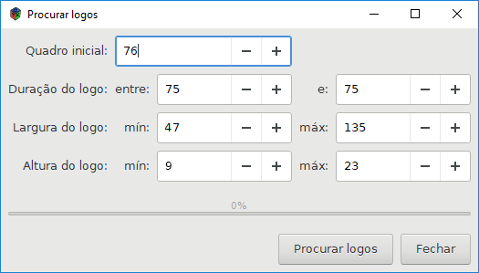
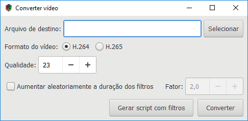

# Usando o multi-delogo

Este documento vai descrever como usar o multi-delogo para remover logos de vídeos.

Usaremos um vídeo de exemplo, distribuído com o multi-delogo: [sample.mp4](../sample.mp4). Este vídeo mostra um gatinho brincando, mas infelizmente tem texto no vídeo. Além disso, o texto muda de posição várias vezes durante o vídeo:

multi-delogo lhe permite marcar todos os lugares onde o texto aparece, e gerar um vídeo sem os textos.

## Iniciando

Ao executar o programa, você verá uma janela com duas opções:

* **Começar um novo projeto** começa um projeto de um arquivo de vídeo.
* **Abrir um projeto existente** lhe permite continuar um projeto já iniciado.

Baixe o [vídeo de exemplo](../sample.mp4) se ainda não o fez, execute o multi-delogo e selecione **Começar um novo projeto**. Selecione o arquivo `sample.mp4`.

## Navegando entre quadros

Esta é a janela principal:

Ela exibe um quadro do vídeo de cada vez.

Para navegar um único quadro para trás ou para frente, use os botões < e >, ou aperte **s** e **d**, respectivamente.

Para saltar um número maior de quadros para trás ou para frente, use os botões << e >>, ou aperte **a** e **d**, respectivamente. Estes botões saltam o número de quadros especificado em **Tamanho do salto**, e você pode alterar o número de quadros conforme a necessidade.

Você também pode ir diretamente para um quadro digitando o número dele e apertando Enter.

Para ajudar na identificação dos quadros onde o logo muda, a função **Quadro anterior** pode ser útil. Ela faz com que dois quadros sucessivos sejam exibidos simultaneamente. Há dois modos:

* **Ajustar à janela** exibe o quadro anterior inteiro, ajustando o zoom para que ele caiba na janela.

* **Mesma visão** mostra o quadro anterior com o mesmo nível de zoom que o atual, e ambos os quadros são rolados em sincroniza, de forma que a mesma região do quadro seja sempre exibida.

Para desbilitar esse recurso, selecione **Não exibir**, e apenas o quadro atual será exibido.

## Definindo um filtro manualmente

No vídeo de exemplo, o texto não é exibido nos quadros iniciais. Temos que navegar até o primeiro quadro em que o texto aparece.

Num caso real, você terá que avançar os quadros até que o texto apareça, usando os saltos para não ter que mover quadro a quadro.

No nosso exemplo, o primeiro quadro com texto é o 76. Mova então para este quadro.

Agora clique próximo ao canto superior esquerdo do texto, e arreste o mouse, desenhando um retângulo demarcando a área com o texto:

Observe agora o lado esquerdo da janela. Observe que há uma linha na lista dizendo **76 - delogo**. Isto é um _filtro_.

Um _filtro_ é uma modificação feita no vídeo, com o objetivo de remover os logos. Os seguintes filtros são disponíveis:

* _delogo_ tenta remover um logo na região marcada. Ele quase sempre funciona e remove o logo, mas dependendo do fundo pode deixar um artefato na região, como se um filtro de desfoque fosse aplicado. Para mais detalhes, veja [a documentação do ffmpeg](https://ffmpeg.org/ffmpeg-filters.html#delogo).

* _drawbox_ desenha um retângulo preto sobre a região marcada. Para mais detalhes, veja [a documentação do ffmpeg](https://ffmpeg.org/ffmpeg-filters.html#drawbox).

* _cut_ remove a parte do vídeo iniciando no quadro inicial do filtro até o início do próximo filtro. Se esse filtro for usado, o áudio terá que ser recodificado.

* _none_ é usado para não aplicar um filtro a uma parte do vídeo.

* _review_ não é um verdadeiro filtro. Ele é criado pelo detector automático (veja [Detectando logos automaticamente](#detectando-logos-automaticamente)) de logos para indicar partes do vídeo em que o logo não pode ser detectado, e que precisam ser revisadas manualmente. Não é possível converter o vídeo enquanto houver filtros review. Você terá que mudá-los para outro tipo (indicando manualmente a posição do logo, ou se não há logo, mudar para _none_, ou removê-los antes da conversão.

Filtros são aplicados do seu _quadro inicial_ até o início do próximo filtro, ou até o fim do vídeo se ele for o último filtro.

## Adicionando mais filtros

O próximo passo é mover para o quadro onde a posição do texto muda, e adicionar um novo filtro iniciando naquele quadro. Isso significa usar os botões de navegação até o quadro em questão ser encontrado.

Se o número de quadros entre a mudança do logo é o mesmo, a função salto pode ser útil: defina o tamanho do salto com o número de quadros em que cada logotipo é exibido, e os botões << e >> moverão entre os quadros em que o logo muda. No nosso vídeo de exemplo, cada logo é exibido por 75 quadros, então defina o tamanho do salto com 75, e clique no botão >>. Você deverá estar no quadro 151, e o logo no canto superior esquerdo não é mais exibido. Ao invés disso, um novo logo no canto superior direito é agora mostrado (use as barras de rolagem ou a função zoom se aquela parte da imagem não for visível).

Para definir a nova posição do logo, o procedimento é o mesmo: desenhe um retângulo cobrindo-o. O resultado deve ser algo como:

Observe o novo filtro adicionado, iniciando no quadro 151.

Agora apenas repita o processo, marcando cada nova posição do logo. Em nosso curto exemplo, há apenas quatro posições:

## Detectando logos automaticamente

Todo o trabalho feito anteriormente talvez não fosse necessário, já que em muitos casos o multi-delogo consegue automaticamente encontrar os logos nos vídeos e criar filtros para eles.

Para usar essa funcionalidade, clique no botão com a lupa na barra de ferramentas. Você verá uma tela como essa:

Você deverá definir alguns parâmetros:

* *Intervalo de busca*: O quadro onde será inicia a busca pelos logos, e o quadro onde ela termina. Por padrão, exceto para vídeos muito curtos, o quadro de término não estará pré-configurado para o fim do vídeo (mas você pode alterar para que seja o último quadro se quiser). Recomenda-se não executar a detecção de logos para o vídeo inteiro de uma vez, mas para executá-la em partes menores do vídeo de cada vez. Isso porque a detecção não é 100% precisa, então é melhor procurar por logos em uma parte, revisar os resultados, e rodar a detecção novamente para a próxima parte.

  No nosso caso, o quadro inicial é 76, que é o primeiro quadro do vídeo com um logo. Como o vídeo é bastante curto, não há necessidade de mudar o quadro final.

* *Duração do logo*: Aqui deve ser informado por quantos frames cada logo é exibido. No nosso caso, é 75 em ambos os campos, já que todos os logos são exibidos por exatamente 75 quadros. Em alguns vídeos os logos podem ser exibidos por de 100 a 105 quadros, então informe estes valores nos campos.

* *Largura do logo* e *altura do logo*: Aqui devem ser especificados os tamanhos mínimo e máximo dos retângulos com os logos.

Quando os parâmetros estiverem definidos, clique o botão *Procurar logos* para iniciar a busca. Esse processo pode demorar, e o estado da busca será exibido na barra de progresso.

Observe que a detecção dos logos não é 100% eficaz. Alguns logos podem não ser detectados. Quando um logo não for encontrado, um filtro do tipo _review_ será inserido para indicar a posição onde a detecção falhou. Você terá que revisar os pontos onde esta detecção falhou, e adicionar um filtro manualmente (ou definir o tipo do filtro como _none_ se não existir um logo).

Além disso, em alguns casos mesmo quando um logo é detectado, o resultado pode não estar certo: o quadro inicial pode estar alguns quadros atrás do valor correto, talvez apenas parte do logo tenha sido reconhecida, ou algum outro artefato do vídeo foi considerado incorretamente como um logo. Por causa disso, é recomendável revisar os resultados antes de converter o vídeo.

Se já existem filtros definidos no intervalo de busca especificado, você terá que confirmar se realmente deseja procurar por logos automaticamente. Os filtros já existentes serão ignorados na busca, mas não serão removidos, apenas filtros novos serão adicionados. A única exceção é se o detector automático de logos encontrar um logo iniciando num quadro que já é o quadro inicial de um filtro. Nesse caso o filtro para o logo automaticamente detectado sobrescreverá o já existente. Por causa desse comportamento, é recomendado evitar procurar por logos em intervalos onde já existem filtros definidos.

### Interrompendo e continuando a deteção de logos

É possível interromper a detecção de logos clicando o botão *Fechar*. Os logos já detectados não serão perdidos.

Para continuar a busca, apenas execute o detector de logos novamente, usando como *Quadro inicial* o primeiro quadro de um logo após o último detectado.

## Editando filtros

A lista à esquerda mostra todos os filtros definidos para o projeto atual. Selecionar uma linha exibe o quadro inicial daquele filtro, bem como a área em que ele é aplicado.

Para editar um filtro existente, você deverá estar no quadro inicial daquele filtro. Você pode mover o retângulo arrastando-o, ou redimensioná-lo arrastando-o pelos cantos ou bordas. Também é possível desenhar um novo retângulo, substituindo o atual. Outra possibilidade é usar os controles **x**, **y**, **largura** e **altura** abaixo da lista de filtros.

Se você não estiver no quadro inicial e fizer alguma alteração, um novo filtro é adicionado.

É possível alterar o quadro inicial de um filtro usando o campo *quadro inicial*. Para alterar o quadro inicial de todos os filtros em um intervalo, aperte o botão **Ajustar quadros iniciais**. Na janela que abrir, selecione o intervalo no qual quer ajustar os quadros iniciais, e quantidade de quadros a adicionar ou subtrair. Todos os filtros naquele intervalo terão seus quadros iniciais ajustados com o valor informado.

Para remover um filtro, selecione-o e aperte o botão com o sinal de menos abaixo da lista de filtros.

Se você cometer um erro, você pode usar o botão **Desfazer** para reveter as últimas alterações. O botão **Refazer** reverte uma ação de desfazer. Ao invés dos botões, é possível usar os atalhos de teclado: Ctrl+z para desfazer, Ctrl+Shift+z ou Ctrl+y para refazer.

Para mover rapidamente entre filtros, use as setas abaixo da lista de filtros.

Se **Rolar para filtro** na barra de ferramentas estiver marcado, ao mover entre filtros o quadro será rolado se necessário para que o retângulo do filtro seja exibido. Se desmarcado, a rolagem não será feita.

## Convertendo o vídeo

Depois que todos os filtros forem definidos, é hora de gerar um novo vídeo sem os logos.

Para fazer isso, clique no botão **Converter**. Uma nova janela será aberta:

Primeiramente, selecione o arquivo de saída usando o botão **Selecionar** ou digitando um caminho.

### Formato e qualidade

As opções **Formato do vídeo** e **Qualidade** definem o codec a utilizar e a qualidade do vídeo gerado.

**Em caso de dúvidas, você pode usar os padrões.** Eles devem gerar um vídeo de alta qualidade compatível com a maioria dos players.

Dois codecs são suportados. H.264 e H.265. H.265 gera arquivos menores, mas a conversão é mais demorada, e nem todos os players suportam esse formato. H.264 é mais compatível e mais rápido, mas os arquivos são maiores.

Para ambos os codecs, o modo CRF é utilizado. O número em **Qualidade** determina a qualidade: em geral, números menores produzem vídeos com mais qualidade, mas os arquivos são maiores. Em caso de dúvida, use os padrões. Para mais detalhes, veja  https://trac.ffmpeg.org/wiki/Encode/H.264#crf e https://trac.ffmpeg.org/wiki/Encode/H.265 .

### Alterando a duração dos filtros

Se **Aumentar duranção dos filtros aleatoriamente** estiver marcado, a duração de cada filtro será aumentada aleatoriamente, fazendo com que eles iniciem antes e/ou terminem depois. A parte originalmente marcada será sempre incluída.

O campo **Fator** controla quanto cada duração é aumentada. Se tem o valor **2**, então cada filtro durará, em média, o dobro do tempo original.

### Executando o conversor

Para fazer a conversão, aperte o botão **Converter**. Isso iniciará o FFmpeg para converter o vídeo, aplicando os filtros. A conversão pode demorar um longo tempo e não pode ser interrompida.

O FFmpeg é incluído no download para Windows, mas no Linux você terá que instalá-lo. Sua distribuição provavelmente tem um pacote com ele.

No Windows, uma janela preta de console aparece enquanto o vídeo é gerado. Isso é normal, a janela é o FFmpeg sendo executado. Não feche a janela, ou a geração do vídeo será interrompida.

### Executando o FFmpeg manualmente

Se você quiser mais controle sobre o processo de conversão, você pode rodar o FFmpeg manualmente. Para fazer isso, ao invés de **Converter**, use **Gerar script com filtros**. Isso gera um arquivo com a descrição dos filtros a aplicar, que pode ser passado para o FFmpeg com a opção `-filter_complex_script`.
